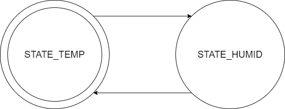
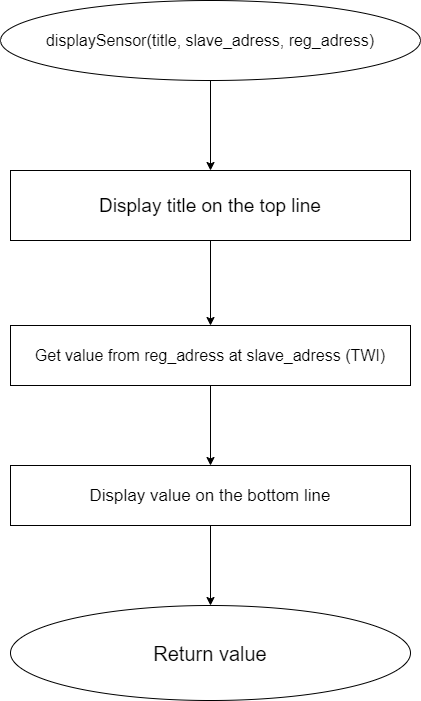
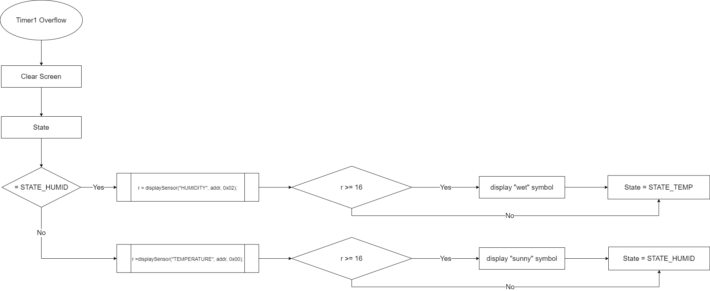

# De2 Meteo Station

### Team members

- Eva Momenceau
- François Soulié
- Paul Tissedre

Link to this file in your GitHub repository:

[https://github.com/francois07/digital-electronics-project](https://github.com/francois07/digital-electronics-project)

### Table of contents

- [De2 Meteo Station](#de2-meteo-station)
    - [Team members](#team-members)
    - [Table of contents](#table-of-contents)
  - [Project objectives](#project-objectives)
  - [Hardware description](#hardware-description)
    - [Sensor - DHT12](#sensor---dht12)
    - [LCD Display - HD44780](#lcd-display---hd44780)
    - [Servo Motor - SG90](#servo-motor---sg90)
  - [Libraries description](#libraries-description)
    - [Delay](#delay)
    - [IO](#io)
    - [Interrupt](#interrupt)
    - [timer](#timer)
    - [stdlib](#stdlib)
    - [UART](#uart)
    - [TWI](#twi)
    - [LCD](#lcd)
    - [GPIO](#gpio)
  - [Main application](#main-application)
    - [Description](#description)
    - [Flowcharts](#flowcharts)
      - [Main function](#main-function)
      - [displaySensor function](#displaysensor-function)
      - [ISR function](#isr-function)
  - [Video](#video)
  - [References](#references)

<a name="objectives"></a>

## Project objectives

_Weather station with 2-axis solar tracking system. The following can be used: temperature, humidity, pressure, light intensity sensors, panel positioning motors, and others._

We decided to focus more on the meteo station side, using a sensor to get temperature and humidity to then display them on screen in a pretty way.

<a name="hardware"></a>

## Hardware description

### Sensor - DHT12

This sensor is used to get temperature and humidity values.

### LCD Display - HD44780

This LCD display was used to display the temperature and humidity values we got from the sensor.

### Servo Motor - SG90

This motor was used to simulate rotations of a solar panel.

<a name="libs"></a>

## Libraries description

### Delay

Functions for busy-wait delay loops

### IO

AVR device-specific IO definitions

### Interrupt

Interrupts standard C library for AVR-GCC

### timer

Timer library made in labs

### stdlib

Standart C Library providing type such as `uint8_t`

### UART

Peter Fleury's UART library

### TWI

TWI library for AVR-GCC

### LCD

LCD library for AVR-GCC

### GPIO

GPIO library made in labs

<a name="main"></a>

## Main application

### Description

As explained in project objectives, we decided to focus more on the meteo station side, since simulating the motors wasn't very relevant (only a few lines of code).
To get temperature and humidity values, we used the `DHT12` sensor with I2C communication. To display them one after they other, we defined a simple state machine.

```C
    // FSM
switch (state)
{
    // Get humidity
    case STATE_HUMID:
        // Display humidity value
        // ...

        state = STATE_TEMP;
        break;

    // Get temperature
    case STATE_TEMP:
        // Display temperature value
        // ...

        state = STATE_HUMID;
        break;

    default:
        state = STATE_TEMP;
        break;
}
```



To display values, we used a custom helper function we called `displaySensor`

```C
uint8_t displaySensor(char title[], uint8_t slave_adress, uint8_t reg_adress)
{
    uint8_t result = 1;
    char res_string[] = "000";

    lcd_gotoxy(1, 0);
    lcd_puts(title);

    twi_start((slave_adress<<1) + TWI_WRITE);
    twi_write(reg_adress);
    twi_stop();

    twi_start((slave_adress<<1) + TWI_READ);
    result = twi_read_ack();

    itoa(result, res_string, 10);

    lcd_gotoxy(0, 1);
    lcd_puts(res_string);

    return result;
}
```

To simulate the solar panels' rotations, we rotate a motor on the side. If it was a real application, we would have to motors: 1 for `X` rotation and 1 for `Y` rotation. Also, there would be a scheduling of the rotation, unlike here where the motor juste goes back and forth between `-90deg` and `90deg`. We also made a helper function for rotating the motors called `rotateMotor`

```C
void rotateMotor(volatile uint8_t *reg_name, uint8_t pin_num, uint8_t period, uint64_t pulse)
{
    GPIO_write_low(reg_name, pin_num);
    for(uint8_t i=0; i < period; i++){
        _delay_ms(20);
        GPIO_toggle(reg_name, pin_num);
        _delay_us(pulse);
        GPIO_toggle(reg_name, pin_num);
    }
}
```

### Flowcharts

#### Main function


#### displaySensor function



#### ISR function



<a name="video"></a>

## Video

You can find our project video [here](https://www.youtube.com/watch?v=LFCsTHv8JU4) (https://www.youtube.com/watch?v=LFCsTHv8JU4)

<a name="references"></a>

## References

1. [SG90 Servo Motor datasheet](Docs/sg90_datasheet.pdf)
2. [DHT12 Sensor datasheet](Docs/dht12_datasheet.pdf)
3. [Arduino Shield](Docs/arduino_shield.pdf)
